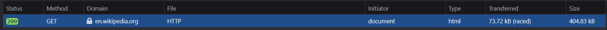
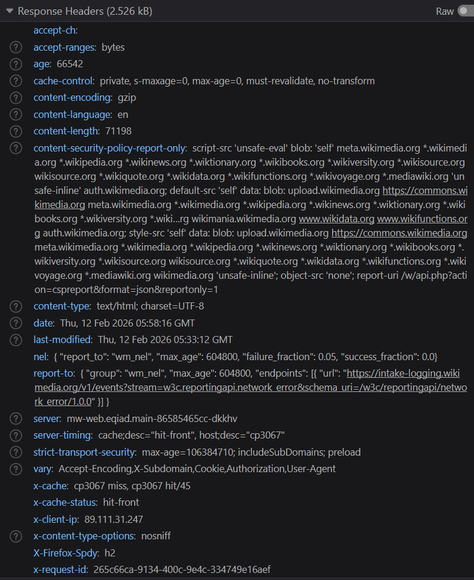
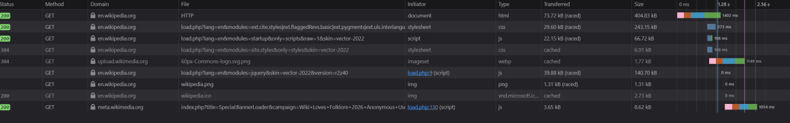
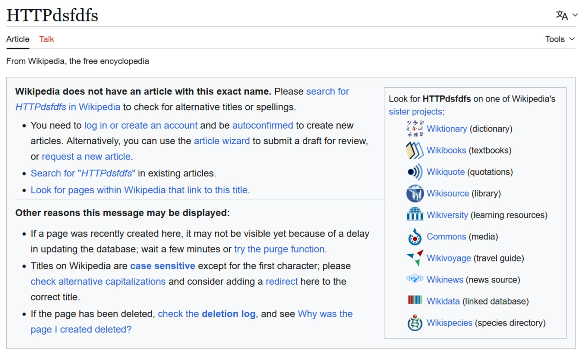
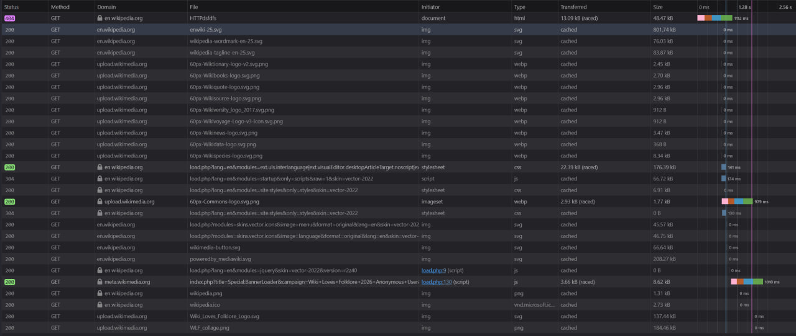
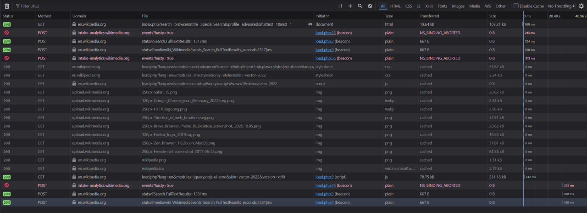
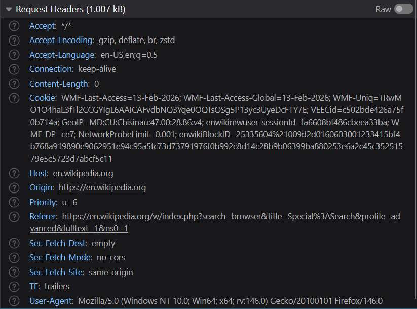
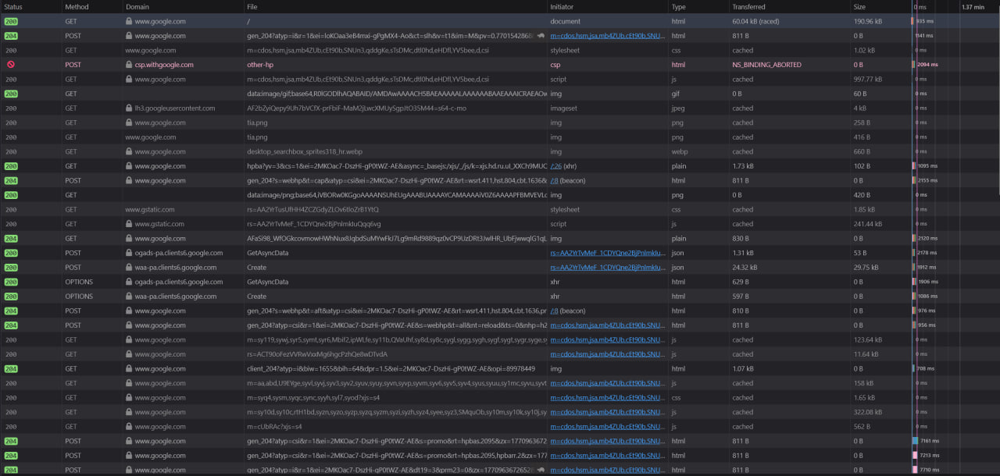
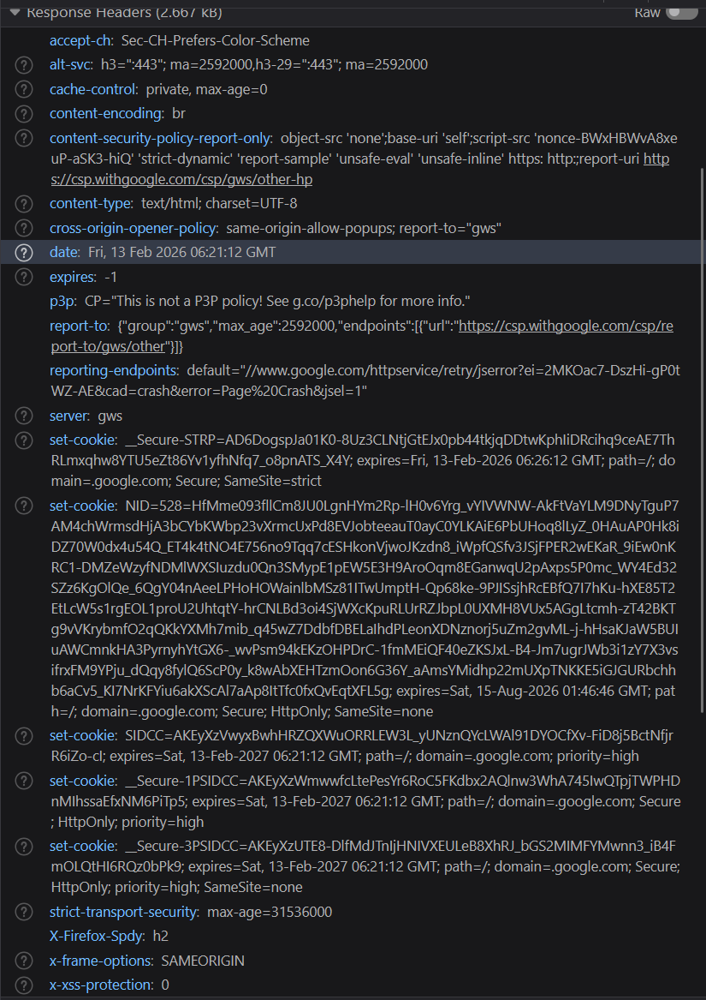

# Lab1

## Инструкция к запуску проекта: 

Открыть этот readme файл в любом приложении, поддерживающем просмотр markdown формата

## Описание лабораторной работы

Знакомство с HTTP запросами

## Краткая документация 

F12 - открыть инструменты разработчика в Mozilla firefox

## Ход работы

### Анализ HTTP-запросов. Часть 1

Первый запрос к странице https://en.wikipedia.org/wiki/HTTP называется HTTP и имеет вид

URL запроса является хост: en.wikipedia.org

Метод: GET. Используется для получения информации с сервера.

Статус ответа: 200. Означает что запрос успешно обработан.

Заголовки запроса: 

Accept: типы контента ожидаемого в качестве ответа

Accept-Encodeng: допустимые алгоритмы сжатия

Accept-Language: язык ответа

Connection: тип открытого соединения

Priority: приоритет этого запроса в случае, если были одновременно отправлены также другие запросы с этой системы

User-Agent: Информация о системе, с которой был произведен запрос

Заголовки ответа: 

acept-ranges: bytes. Позволяет серверу указать, что он поддерживает запрос части полного ресурса клиентом.

Age: indicates the time in seconds for which an object was in a proxy cache. (Mozilla dev docs)

content-encoding: адгоритс шифрования/сжатия

Content-language: язык ответа

content-length: размер body в байтах

server: описание машины, с которой пришел ответ

Тело ответа содержит html документ со страницей.

Так же было отправлено несколько запросов, ответы на которые содержат php скрипты, css и иконки 

#### Запрос к невалидному адресу

При запросе к https://en.wikipedia.org/wiki/HTTPdsfdfs получаем сообщение об ошибке, т.к. данной страницы на этом хосте не существует

Запросы в консоли: 

Первый GET запрос получил ответ 404 bad request, что означает отсутствие страницы на хосте

### Анализ HTTP-запросов. Часть 2

Если ввести browser в строку поиска https://en.wikipedia.org/wiki/Special:Search, можно получить следующий вид dev консоли:

Разбор отдельного post запроса:

POST запрос используется для выделения ресурсов на сервере, в данном случае для сохранения слова введенного пользователем.

Параметры запроса: search=browser - введенное в поисковое поле слово. 

title=Special%3ASearch - имя страницы, на которой должна произойти обработка запроса. 

profile=advanced - задает профиль поиска.

 fulltext=1 - Параметр, который включает поиск по полному тексту (полным содержимым страниц). Значение 1 означает, что этот фильтр активирован, то есть поиск будет выполняться по тексту статей, а не только по заголовкам.

 ns0=1 - Описание: Параметр ns0 указывает, что поиск должен ограничиваться только основным пространством имён (основными статьями). Пространства имён в Википедии используются для классификации страниц, и ns0 — это код для основного пространства имен (статьи). Значение 1 активирует этот фильтр.

 ### Анализ HTTP-запросов. Часть 3

 Анализ HTTP запроса https://www.google.com/ 

 

 Здесь можно наблюдать множество запросов, включающих в себя style sheets, скрипты, изображения. Разбор первого GET запроса:

 

accept-ch: Sec-CH-Prefers-Color-Scheme. Предпочтительная визуальная тема для пользователя.

alt-svc: h3=":443"; ma=2592000,h3-29=":443"; ma=2592000. Указание альтернативного сервера для будущих запросов

cache-control: private, max-age=0. Управление кэшированием. private - кэш хранится только локально у пользователя. max-age - кол-во секунд, которые страница из кэша считается свежей.

### Задание 4. Составление HTTP-запросов

#### GET-Запрос

GET / HTTP/1.1
Host: sandbox.usm.com
User-Agent: Vladyslav Yakovlev

User-Agent используется для передачи информации о устройстве, с которого был произведен запрос. ОС, браузер.

#### POST-запрос

POST /cars HTTP/1.1
Host: sandbox.usm.com
Content-Type: application/json
User-Agent: Vladyslav Yakovlev

{
    "make": "Toyota",
    "model": "Corolla",
    "year": 2020
}

Так же существуют PUT (полная замена ресурса на сервере), PATCH(частичное изменение ресурса, его полей) и DELETE(удалить ресурс), HEAD(GET, запрашивается только head), OPTION (узнать методы, которые поддерживает сервер при работе с этим ресурсом)

#### PUT-запрос

PUT /cars/1 HTTP/1.1
Host: sandbox.usm.com
User-Agent: Vladyslav Yakovlev
Content-Type: application/json

{
  "make": "Nissan",
  "model": "SkyLine",
  "year": 2002
}

#### Возможный ответ 

POST /cars HTTP/1.1
Host: sandbox.com
Content-Type: application/json
User-Agent: John Doe
model=Corolla&make=Toyota&year=2020

Возможные ответы:

201 Created — этот статус код означает, что запрос был успешным, и новый ресурс был создан. Сервер создает новый объект на основе переданных данных.

400 Bad Request — этот код означает, что сервер не может обработать запрос из-за синтаксической ошибки. Например, если данные не соответствуют ожидаемому формату (вместо JSON передан model=Corolla&make=Toyota&year=2020, что может быть ошибкой, если сервер ожидает JSON).

500 Internal Server Error — если сервер не может обработать запрос по внутренним причинам, например, если произошел сбой в серверной логике или недостаточно ресурсов для обработки запроса.

Возможные ответы: 200 - возвращение информации о созданном ресурсе / успешное выполнение (плохая практика).

201 Created - ресурс успешно создан

400 Bad Request — когда запрос некорректен (например, неверный формат данных).

401 Unauthorized - не предоставлены учетные данные для доступа к защищенному ресурсу

403 Forbidden - недостаточно прав польщователя для запроса этого ресурса

404 Not found - запрашиваемого ресурса не существует

500 Internal server error - ошибка на стороне сервера