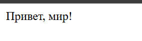
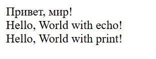
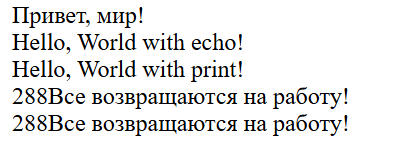

# Lab2

## Инструкция по запуску проекта

Клонировать репозиторий, установить php и php server. Выполнить команду php -S localhost:\<port> и проверить в браузере по адресу http://localhost:\<port>

## Описание лабораторной работы

Установка и настройка среды разработки для работы с языком программирования PHP, а также создание первой программы на PHP.

## Краткая документация 

XAMPP: X- cross platform, A - apache, M - mariadb, P - php, P - perl

## Ход работы

### Шаг 1: Установка PHP

Перейти на официальный сайт PHP: https://www.php.net/downloads. Выбрать ОС, скачать архив с последней thread-safe версией языка
```
VS17 x64 Thread Safe
2026-Feb-10 18:50:42 UTC
```
Распаковать в удобную директорию (C:\Program Files\php).

Добавьте путь к PHP в переменные среды (Path):
```
Откройте Параметры системы (Win + R → sysdm.cpl).
Перейдите в Дополнительно → Переменные среды.
В разделе Системные переменные выберите Path и добавьте путь C:\Program Files\php\php-8.5.3-Win32-vs17-x64.
Сохраните изменения.
```

Проверьте установку, выполнив в командной строке: php -v.
```
output:
PHP 8.5.3 (cli) (built: Feb 10 2026 18:44:09) (ZTS Visual C++ 2022 x64)
Copyright (c) The PHP Group
Built by The PHP Group
Zend Engine v4.5.3, Copyright (c) Zend Technologies
    with Zend OPcache v8.5.3, Copyright (c), by Zend Technologies
```

### Шаг 2. Написание первой PHP-программы

Создайте директорию для проекта, например: D:\Projects\PHP\01_Introduction.
```
mingw64:
cd <path>
mkdir 01_introduction
```
Создайте файл index.php и откройте его в текстовом редакторе.
```
 echo init >> index.php
 nano index.php
```

Вставьте следующий код:
```
<?php

echo "Привет, мир!";
```

Запустите программу с помощью встроенного веб-сервера PHP.
```
php -S localhost:8000
```

Проверить работоспособность можно по адресу http://localhost:8000


### Шаг 3. Вывод данных в PHP

Выведите строку "Hello, World!" используя функцию echo и print.
```
echo "Hello, World with echo!<br />";
print "Hello, World with print!<br />";
```


### Шаг 4. Работа с переменными и выводом

Создайте две переменные:

Целочисленную переменную $days со значением 288
```
$days = 288;
```
Строковую переменную $message с текстом: Все возвращаются на работу!.
```
$message = "Все возвращаются на работу!";
```

Выведите значения переменных на экран несколькими способами:

С использованием конкатенации. Конкатенация - это объединение строк, в PHP используется оператор .:
```
echo $days.$message."<br />";
```

С использованием двойных кавычек.
```
echo "{$days}{$message}<br />";
```
Используйте переход на новую строку в выводе используя тэг \<br />.



## Контрольные вопросы

1. Какие способы установки PHP существуют?

```
1. Установка минимальной сборки/исходников и набора инструментов  (напр. php server) с официального сайта https://www.php.net/downloads.

2. Установка и быстрая настройка php вместе со средой разработки XAMPP (PHP, MariaDB, Perl) с сайта https://www.apachefriends.org.
```
2. Как проверить, что PHP установлен и работает?

Вызвать в консоли собранный exe с параметром -v
```
php -v
```

3. Чем отличается оператор echo от print?

echo работает быстрее, не имеет возвращаемого значения и принимает несколько аргументов, тогда как print всегда возвращает 1, работает медленнее и принимает только один аргумент.