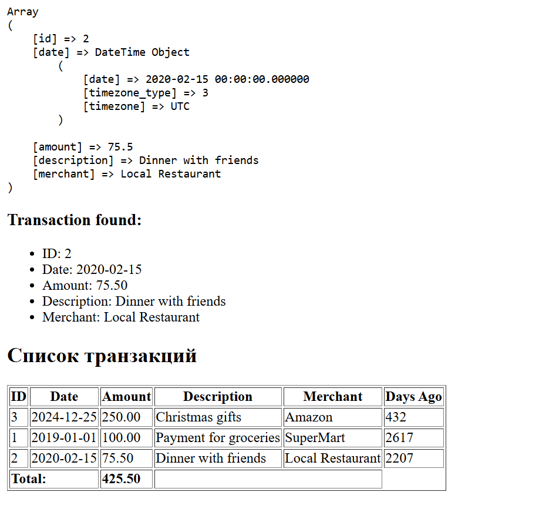

# Lab 4

IA2404 Yakovlev Vladyslav

## Инструкция по запуску проекта

Перейти в папку проекта с файлом index.php

Запустить встроенный сервер PHP:
```
php -S localhost:8000
```

Открыть в браузере:
http://localhost:8000

## Описание лабораторной работы

Лабораторная работа позволяет освоить работу с массивами в PHP, применяя различные операции: создание, добавление, удаление, сортировка и поиск. Закрепить навыки работы с функциями, включая передачу аргументов, возвращаемые значения и анонимные функции.

## Краткая документация

scandir($dir) - системная функция для получения массива файлов и папок из указанной директории

## Ход работы

### Задание 1. Работа с массивами

Разработать систему управления банковскими транзакциями с возможностью:
- добавления новых транзакций;
- удаления транзакций;
- сортировки транзакций по дате или сумме;
- поиска транзакций по описанию.

В начале файла с исходным кодом включить строгую типизацию:

```
<?php

declare(strict_types=1);
```

Создать массив $transactions, содержащий информацию о банковских транзакциях. Каждая транзакция представлена в виде ассоциативного массива с полями:

- id – уникальный идентификатор транзакции;
- date – дата совершения транзакции (YYYY-MM-DD);
- amount – сумма транзакции;
- description – описание назначения платежа;
- merchant – название организации, получившей платеж.

Примечание: для работы с датами можно использовать класс DateTime.

Использовать foreach, чтобы вывести список транзакций в HTML-таблице.

```
<table border="1">
    <thead>
        <tr>
            <th>ID</th>
            <th>Date</th>
            <th>Amount</th>
            <th>Description</th>
            <th>Merchant</th>
        </tr>
    </thead>

    <tbody>
        <?php foreach ($transactions as $transaction): ?>
            <tr>
                <td><?= $transaction['id'] ?></td>
                <td><?= $transaction['date']->format('Y-m-d') ?></td>
                <td><?= number_format($transaction['amount'], 2) ?></td>
                <td><?= htmlspecialchars($transaction['description']) ?></td>
                <td><?= htmlspecialchars($transaction['merchant']) ?></td>
            </tr>
        <?php endforeach; ?>
    </tbody>
</table>
```

Создайте и используйте следующие функции:

Создайте функцию calculateTotalAmount(array $transactions): float, которая вычисляет общую сумму всех транзакций.

```
function calculateTotalAmount(array $transactions): float
{
    $total = 0.0;

    foreach ($transactions as $transaction) {
        $total += $transaction['amount'];
    }

    return $total;
}
```
Выведите сумму всех транзакций в конце таблицы.
```
<tr>
    <td colspan="2"><strong>Total:</strong></td>
        <td><strong>
                <?= number_format($totalAmount, 2) ?>
        </strong></td>
    <td colspan="2"></td>
</tr>
```

Создайте функцию findTransactionByDescription(string $descriptionPart), которая ищет транзакцию по части описания.
```
function findTransactionByDescription(string $descriptionPart): ?array
{
    global $transactions;

    foreach ($transactions as $transaction) {
        if (stripos($transaction['description'], $descriptionPart) !== false) {
            return $transaction;
        }
    }

    return null;
}
```

Создайте функцию findTransactionById(int $id), которая ищет транзакцию по идентификатору. Реализуйте данную функцию с помощью функции array_filter (на высшую оценку).
```
function findTransactionById(int $id): ?array
{
    global $transactions;

    $filtered = array_filter(
        $transactions,
        fn($transaction) => $transaction['id'] === $id
    );

    if (empty($filtered)) {
        return null;
    }

    return array_values($filtered)[0];
}
```

Создайте функцию daysSinceTransaction(string $date): int, которая возвращает количество дней между датой транзакции и текущим днем.
```
function daysSinceTransaction(string $date): int
{
    $transactionDate = new DateTime($date);
    $currentDate = new DateTime();

    $difference = $currentDate->diff($transactionDate);

    return (int) $difference->format('%a');
}
```

Добавьте в таблицу столбец с количеством дней с момента транзакции.
```
<td>
    <?= daysSinceTransaction($transaction['date']->format('Y-m-d')) ?>
</td>
```

Создайте функцию addTransaction(int $id, string $date, float $amount, string $description, string $merchant): void для добавления новой транзакции.
Примите во внимание, что массив $transactions должен быть доступен внутри функции как глобальная переменная.
```
function addTransaction(
    int $id,
    string $date,
    float $amount,
    string $description,
    string $merchant
): void {
    global $transactions;

    foreach ($transactions as $transaction) {
        if ($transaction['id'] === $id) {
            return;
        }
    }

    $transactions[] = [
        "id" => $id,
        "date" => new DateTime($date),
        "amount" => $amount,
        "description" => $description,
        "merchant" => $merchant,
    ];
}
```

Задание 1.5. Сортировка транзакций
Отсортируйте транзакции по дате с использованием usort().
```
// Sort by date (ascending)
usort($transactions, function ($a, $b) {
    return $a['date'] <=> $b['date'];
});
```

Отсортируйте транзакции по сумме (по убыванию).
```
// Sort by amount (descending)
usort($transactions, function ($a, $b) {
    return $b['amount'] <=> $a['amount'];
});
```

Result:


### Задание 2. Работа с файловой системой

Создайте директорию "image", в которой сохраните не менее 20-30 изображений с расширением .jpg.

Затем создайте файл index.php, в котором определите веб-страницу с хедером, меню, контентом и футером.

Выведите изображения из директории "image" на веб-страницу в виде галереи.

Result: 


## Контрольные вопросы

1. Что такое массивы в PHP?

Массив в PHP — это структура данных, которая позволяет хранить несколько значений в одной переменной. Например: $numbers = [1, 2, 3]; или ассоциативный массив $user = ["name" => "John", "age" => 25];.

2. Каким образом можно создать массив в PHP?

Массив можно создать с помощью конструкции array() или короткого синтаксиса []. Например: $arr = array(1, 2, 3); или $arr = [1, 2, 3];.

3. Для чего используется цикл foreach?

Цикл foreach используется для перебора элементов массива. Например: foreach ($arr as $value) { echo $value; }.